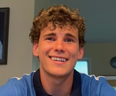

---
# We make this page and not home to suppress the post list.
layout: page
---

{: .tom-image}

I live in Bethesda, Maryland.
I am a Math and Computer Science Double Major at the University of 
Virginia. I graduated from Walt Whitman High School with a 4.6 GPA. While there, I received
a D1 offer to play soccer for Davidson and I won two 4A State Championships.

At UVA, I began my role as a teaching assistant under [Elizabeth Orrico][eo] in 
Discrete Math and Theory 1 in the spring of my first year. I also worked 
that semester as a food server and pizza chef for Runk Dining Hall.
In the fall of my sophomore year, I joined the club soccer team and played as a
practice player for the Women's Varsity Soccer Team.

I enjoy puzzles, namely the crossword and minesweeper, as well as comics, specifically
Calvin and Hobbes. I also love climbing and hiking.

In the projects tab you'll find more of where my interests take me.

This summer I look forward to working with [Dr. Tom Hartvigsen][th] on our Machine Learning
research. Check out the research tab for more.

In the notes tab you'll find notes that I compiled as a student and TA.

[eo]: https://engineering.virginia.edu/faculty/elizabeth-orrico
[th]: https://www.tomhartvigsen.com/